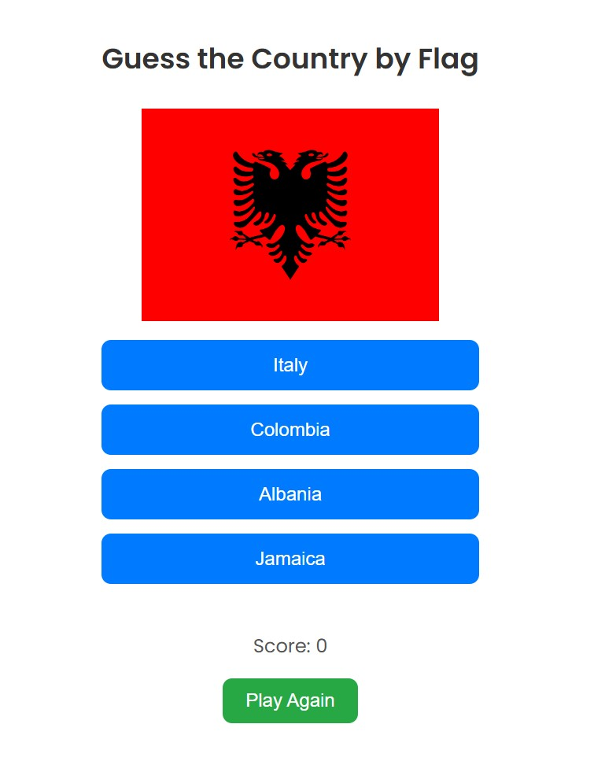

# Guess the Country by Flag
A quiz game that is both fun and educational, where the player guesses the country based on the flag displayed. My daughter and I love to travel so this game was designed to help her remember the flags of the countries we have visited together. 

## Screenshot

## Technologies Used
    - JavaScript
    - HTML
    - CSS

## Getting Started
[Click Here to Play!](https://bejaze.github.io/quiz-game/)

## Next Steps
For future enhancement, the list of countries will grow and animations will be added. 